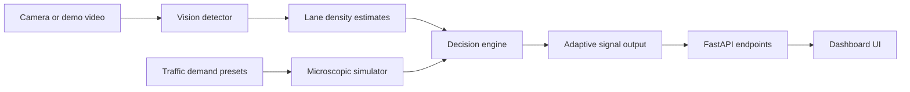

# Architecture

## Control plane

The control plane is centered around `DecisionEngine`. It scores each signal phase using:

- lane density
- queue length
- waiting time
- speed penalty
- emergency vehicle bonus
- starvation bonus
- continuity bonus

Safety and stability features:

- minimum green bounds
- maximum green bounds
- hysteresis to stop oscillation
- anti-starvation history

## Simulation plane

`TrafficSimulator` uses the same demand realization for both controllers, which makes the comparison fair. That means the baseline and adaptive controllers face exactly the same arrivals.

Metrics produced:

- average wait
- p95 wait
- throughput
- max queue
- mean queue
- idle fuel estimate
- CO2 estimate
- dropped arrivals from queue overflow

## Vision plane

The bundled detector uses background subtraction and centroid tracking. This works best for stable overhead videos and is ideal for a demo. Production deployment should swap in a trained object detector.

## API and UI plane

FastAPI serves both the JSON APIs and the frontend dashboard. The UI is intentionally zero-build so the app can be launched quickly on any machine with Python.
